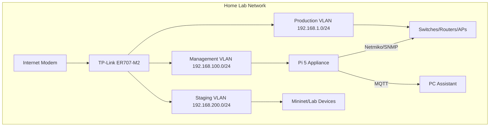

# Network-Chan System Architecture

This document provides a high-level overview of Network-Chan's architecture, drawing from the System Architecture Document (SAD) in the project files. It includes components, modules, APIs, data flows, network topology, deployment setup, and rationale for chosen technologies. The architecture follows a split, three-brain model for safety: Perception (edge collection), Decision (policy/RL), and Governance (safety/intent). The Appliance (Raspberry Pi 5) handles fast-loop autonomy, while the Assistant (PC/server) provides advanced reasoning and UX.

All operations are local-only, with fail-open design, recoverable states (snapshots/rollbacks), and policy-governed automation. Extensible from homelab to enterprise.

Updated: March 15, 2026.

## Three-Brain Model

The core architecture separates concerns for observability and safety:

- **Perception Brain**: Real-time state collection (edge-focused on Appliance).
- **Decision Brain**: Policy optimization and learning (hybrid: lightweight on Appliance, advanced on Assistant).
- **Governance Brain**: Safety enforcement and approvals (central on Assistant).

This ensures retractable actions and prevents unchecked AI interventions.

## High-Level Components and Modules

### 1. Perception Brain (Appliance on Raspberry Pi 5)

- **Modules**:
  - Network Monitor: Interfaces with Omada API, psutil, Netmiko for device polling.
  - Telemetry Ingestor: Prometheus scrapers, PySNMP for SNMP.
  - Graph Builder: NetworkX for topology features (inputs to GNNs).
- **Purpose**: Collect metrics, build episodic records, produce GNN-ready graphs.
- **Tech Rationale**: Lightweight libs for Pi efficiency; async I/O via asyncio for concurrency.

### 2. Decision Brain (Hybrid: Edge on Appliance, Central on Assistant)

- **Edge Modules (Appliance)**:
  - Lightweight RL Agent: TinyML (TFLite/ONNX) + Q-Learning for actions.
  - Meta-Learner: REPTILE for adaptation.
  - TinyGNN: Quantized GCN (2-3 layers) for local topology embedding.
- **Central Modules (Assistant)**:
  - Global Trainer: Ray RLlib for RL-MAML, PyTorch Geometric (PyG) for full GNNs.
  - LLM Assistant: Ollama + LangChain for RAG-based advice.
- **Purpose**: Anomaly prediction, policy optimization, grounded insights. Assistant trains full models and pushes quantized updates to Appliance via MQTT.
- **Tech Rationale**: Numba for edge perf; Ray for distributed training; quantization (int8) reduces model size 4-8x for Pi.

### 3. Governance Brain (Assistant on PC)

- **Modules**:
  - Policy Engine: FastAPI microservice for RBAC/ABAC, autonomy levels (1-5).
  - Audit Logger: Immutable logs to SQLite.
  - Approval Daemon: Async workflows for human-in-loop confirmations.
- **Purpose**: Enforce rules, log actions, support fail-safes (e.g., rollback snapshots).
- **Tech Rationale**: FastAPI for async APIs; type annotations for maintainability.

## APIs and Interfaces

- **Internal APIs**: FastAPI for inter-module comms (e.g., /governance/approve_action).
- **External Interfaces**: MQTT 5.0 (Mosquitto) for pub/sub; Omada API/Netmiko for device control.
- **Admin UI**: Vue 3 dashboard served via FastAPI (at /dashboard), with WebSockets for real-time updates.

Example API Endpoint (from governance.py stub):

- GET /policies: Returns autonomy levels (typed response: List[int]).

## Data Flows

Data moves securely and asynchronously:

1. Telemetry: Appliance ingests -> processes locally (TinyGNN embedding) -> publishes to MQTT.
2. Incidents: Detected anomalies -> stored in SQLite/FAISS -> RAG query via Assistant LLM.
3. Model Updates: Assistant trains full GNN -> quantizes -> MQTT push to Appliance (dynamic load).
4. Actions: Decision suggests -> Governance approves -> Appliance executes (with rollback).

### Data Flow Diagram (Mermaid)

```mermaid
graph TD
    A[Devices (Routers/APs)] -->|SNMP/Omada| B[Appliance: Perception]
    B -->|Local Inference (TinyGNN/Q-Learning)| C[Appliance: Execution Daemon]
    B -->|MQTT Pub| D[Assistant: Decision/Governance]
    D -->|Train/Quantize GNN| E[MQTT Push Model]
    E --> B
    D -->|LLM RAG/Chat| F[Admin UI (Vue)]
    C -->|Safe Actions| A
```

## Network Topology

Deploys in segmented VLANs for isolation:

- Management VLAN (192.168.100.0/24): Appliance + Controller.
- Staging VLAN (192.168.200.0/24): For testing (Mininet sims).
- Production VLAN (192.168.1.0/24): Devices.

Redundancy: MQTT heartbeats; failover to standalone Appliance mode.

### Topology Diagram (Mermaid)



## Deployment Setup

- **Appliance**: systemd service on Pi (lightweight Docker optional for arm64).
- **Assistant**: Docker Compose for PC (FastAPI + Vue + Ollama).
- **Shared**: SQLite files synced via MQTT dumps; FAISS indexes local to each.
- **CI/CD**: GitHub Actions for builds/tests (per release plan).

Example Deployment Command (Appliance):

```terminal
sudo systemctl start network-chan-appliance
```

## Integration Points

- **SDN Devices**: Primary TP-Link Omada; fallback Netmiko for multi-vendor.
- **Simulation**: Mininet/PettingZoo for RL envs.
- **High Availability**: Optional VRRP for MQTT broker.
- **Testing**: Pytest for units; Locust for load.

## Technology Rationale

- **Python 3.12**: For type hints, asyncio concurrency, and efficiency.
- **ML Stack**: Torch/PyG for GNNs (Numba-optimized); Ray for scalable RL.
- **DB**: SQLite (embedded, low-overhead); FAISS for vector search.
- **Transport**: MQTT (async, lightweight) over TLS.
- **UI**: FastAPI (async APIs); Vue (reactive dashboard).
- **Efficiency**: Quantization/Numba for Pi; types for maintainability.

For detailed specs, refer to the full SAD (project document:1000002247). Questions? Open an issue once repo is online.
