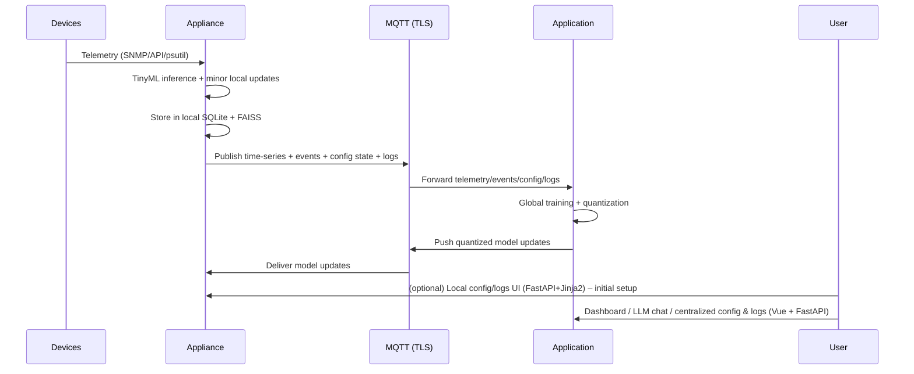

# Network-Chan System Architecture Document

**Project name:** Network-Chan  
**Date:** 2026-03-21  
**Version:** 1.1 (refined & updated)  

## Introduction

Network-Chan is a local-only autonomous SDN management plane consisting of two cooperating layers that communicate primarily via secure MQTT:

- **Network Appliance:** A lightweight edge MLOps controller (reference platform: Raspberry Pi 5) handling real-time telemetry ingestion, small-scale training & inference, immediate policy-approved remediation, and a minimal built-in configuration interface.
- **Application:** The central AIOps component (PC, mini-PC, or server) providing global training, model quantization & distribution, advanced analytics, persistent memory with RAG, governance enforcement, and rich user interfaces.

All operations are strictly local with no cloud dependencies, no external calls, and no third-party recurring costs. Core principles:

- Local-only execution
- Fail-open design (network continues without Network-Chan)
- Recoverable states via snapshots and rollback
- Policy-governed automation with configurable autonomy levels
- Mandatory TLS on MQTT and forced TOTP 2FA setup on first login (both Appliance and Application)

The **Network Appliance** is a fully standalone-capable device. Users can deploy it directly on their network, perform initial setup via its built-in web interface, and let it operate autonomously (albeit with slower adaptation and reduced capability compared to when paired with the Application).

**Future cryptographic enhancement (planned):** Transition to post-quantum cryptography (PQC) algorithms ML-KEM (key encapsulation) and ML-DSA (digital signatures) for MQTT TLS and model signing, to provide forward-looking resistance to quantum threats.

## High-Level System Overview

```text
Network Devices (Omada / UniFi / SNMP / Netmiko)
          │
          ▼
Network Appliance (Edge – Raspberry Pi 5)
   ├─ TinyML inference + small-scale local training
   ├─ Local SQLite + FAISS (for TinyML usage & caching)
   ├─ Prometheus-compatible time-series publishing
   └─ Lightweight FastAPI + Jinja2 config/settings/log viewer (initial setup & local access)
          │
          ▼
Secure MQTT (asyncio-mqtt + TLS)
          │
          ▼
Application (Central – PC/Server – background service)
   ├─ Global multi-agent RL-MAML training
   ├─ Model quantization & push to Appliance
   ├─ Persistent SQLite + FAISS (full RAG)
   └─ FastAPI backend + Vue 3 / Vite dashboard (with Prometheus/Grafana embeds)
          ▲
          │ (Appliance pushes config/logs → centralized view)
```

## Core Components & Responsibilities

### 1. Network Appliance (Edge Layer)

**Purpose**: Low-latency perception, lightweight learning, safe remediation, and standalone operation.

**Key Responsibilities**:

- **Telemetry Collection & Publishing** — Omada API, SNMP v3, Netmiko, psutil → feature vectors + Prometheus-compatible time-series metrics published via MQTT
- **Local Storage** — SQLite (incident & config logs) + FAISS (vector index for TinyML retrieval & local RAG-like usage)
- **ML Engine** — TinyML (TinyGNN, Q-Learning and REPTILE) for anomaly detection, prediction, and small-scale on-device training/adaptation
  - Performs minor local model updates based on recent observations
  - Receives major quantized model updates pushed from Application (when present)
- **Policy & Safety** — Enforces autonomy levels, rate limits, action whitelists, rollback on failure
- **Execution** — Trusted daemon applies approved remediations (channel change, steering, port disable, etc.)
- **Local UI** — FastAPI + Jinja2 web interface (http://<appliance-ip>:8001) for initial setup, basic config changes, logs, and status (primarily used during onboarding or troubleshooting)
- **Centralized Visibility Push** — Publishes current config state and logs to Application via MQTT for unified viewing and management (user prefers to configure/view via Application dashboard when available)
- **Security** — Mandatory TOTP 2FA setup on first login; all MQTT traffic uses TLS

### 2. Application (Central Layer – Background Service)

**Purpose**: Heavy training, model distribution, long-term memory, governance, and rich user experience.

**Key Responsibilities**:

- **Background Operation** — Runs as a persistent service with the dashboard being accessible via an application based on using an Electron wrapper or using a web browser
  - Auto-logout after inactivity; re-authentication (with TOTP) required on reopen
- **Data Ingestion & Storage** — Subscribes to MQTT time-series/events/config/logs → Prometheus (metrics), SQLite (incidents/config), FAISS (vectors)
- **ML Training & Distribution** — multi-agent, GNN-based RL-MAML using Q-Learning elements (Ray RLlib + PettingZoo + PyTorch Geometric)
  - Quantizes models and pushes major updates to Appliance via MQTT
- **Persistent Memory & RAG** — Full FAISS + SQLite for cross-incident retrieval → context-grounded LLM responses
- **User Interfaces** — FastAPI backend + Vue 3 / Vite frontend dashboard
  - Interactive topology (Vis.js), charts (Chart.js), Grafana embeds
  - LLM assistant (Ollama + LangChain), optional voice (Web Speech API) + VAD/personality modes
  - Centralized config viewer/editor and log browser (pulls from Appliance-published data)
- **Security** — Mandatory TOTP 2FA setup on first login; TLS everywhere

## Governance & Security

- **Policy Engine** — Validates actions against autonomy mode, rate limits, whitelists; triggers rollback on failure
- **Authentication** — Forced TOTP 2FA setup during initial configuration (both Appliance and Application); session-based login with auto-logout
- **MQTT Security** — TLS 1.3 mandatory; ACLs restrict topics per role/device
- **Fail-safe Design** — All remediations are atomic + reversible; network defaults if Appliance/Application unavailable
- **Future PQC** — Planned upgrade of TLS cipher suites and model signing to include ML-KEM (key exchange) and ML-DSA (signatures)

## Data Flows



## Technology Choices

- **Messaging**: asyncio-mqtt (async pub/sub) + Mosquitto broker (TLS)
- **Edge ML**: TinyML (TFLite/ONNX), TinyGNN, Q-Learning + REPTILE
- **Central ML**: Ray RLlib, PettingZoo, PyTorch Geometric
- **Storage**: SQLite + FAISS (both layers)
- **Monitoring**: Prometheus + Grafana
- **UI**: FastAPI (backend), Vue 3 + Vite (Application dashboard), Jinja2 (Appliance config UI)
- **LLM/RAG**: Ollama + LangChain
- **Simulation**: Mininet

This architecture supports standalone edge operation while enabling richer, faster adaptation when the central Application is present — all with strong security, privacy guarantees, and centralized visibility for configuration and logs.
