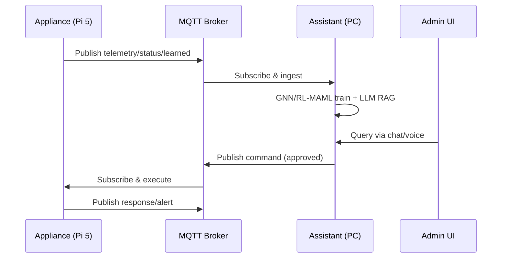

# Network-Chan System Architecture Document

**Prepared for:** Home lab / research deployment  
**Project name:** Network-Chan  
**Date:** 2026-03-14  
**Version:** 1.0  

## Introduction

This System Architecture Document (SAD) provides a detailed overview of Network-Chan's high-level architecture, including components, modules, APIs, data flows, network topology, deployment setup, integration points, and the rationale for chosen frameworks, libraries, and technologies. It blends the three-brain safety-first model from the project proposal (Perception, Decision, Governance) with the refined split design (Appliance on Raspberry Pi 5 for edge perception and lightweight reinforced meta-learning, Assistant on PC for central decision-making, governance, emotional/personality UX, and admin interface).

The architecture prioritizes local-only operation, fail-open design, recoverable states, and policy-governed automation. It supports homelab/research use while being extensible to prosumer/professional/enterprise scenarios.

## High-Level Architecture

Network-Chan uses a split, three-brain model to separate perception (state collection), decision (policy/RL), and governance (safety/intent), ensuring observability and retractability. The Appliance (edge MLOps) handles fast-loop, autonomous operations on the Pi 5, while the Assistant (central AIOps) provides richer reasoning and UX on a powerful PC.

### Components and Modules

1. **Perception Brain (Appliance on Pi 5)**  
   - Modules: Network Monitor (Omada API/psutil/Netmiko), Telemetry Ingestor (Prometheus scrapers, SNMP via PySNMP), Graph Builder (NetworkX for topology features).  
   - Purpose: Collect real-time metrics, build GNN inputs, produce episodic records.

2. **Decision Brain (Hybrid: Edge on Pi, Central on Assistant)**  
   - Edge Modules: Lightweight RL Agent (TinyML + Q-Learning for action selection), Meta-Learner (REPTILE for model adaptation).  
   - Central Modules: Global Trainer (Ray RLlib for RL-MAML, PyTorch Geometric for GNNs), LLM Assistant (Ollama + LangChain for RAG).  
   - Purpose: Predict anomalies/congestion, optimize policies, generate grounded advice.

3. **Governance Brain (Assistant on PC)**  
   - Modules: Policy Engine (FastAPI microservice with SQLite audit log), Autonomy Mode Controller (5 levels from OFF to EXPERIMENTAL).  
   - Purpose: Enforce rules, RBAC, whitelists, rate limits, approvals.

4. **Execution Layer (Appliance on Pi)**  
   - Modules: Trusted Daemon (small Python service for Netmiko/Omada API calls).  
   - Purpose: Execute approved commands with timeouts/verification.

5. **Memory & Retrieval (Hybrid: Edge on Pi, Central on Assistant)**  
   - Modules: Local Storage (SQLite + FAISS on Pi for recent vectors), Central Index (FAISS on Assistant for full RAG).  
   - Purpose: Store incidents, enable retrieval for LLM/RL retraining.

6. **Admin UI & UX (Assistant on PC)**  
   - Modules: Vue 3 Dashboard (Vite + Bootstrap, real-time charts via Chart.js, topology via Vis.js), Chat Interface (WebSocket), Voice (Web Speech API), Emotional Layer (VAD scoring + personality templates).  
   - Purpose: Interactive querying, visualizations, optional TTS/STT.

7. **Messaging & Integration (Shared)**  
   - Modules: MQTT Broker (Mosquitto with TLS/ACLs), paho-mqtt Clients.  
   - Purpose: Secure telemetry/command transport.

### APIs

- **Internal APIs (FastAPI)**:  
  - Appliance: Minimal endpoints (/health, /metrics, /status, /logs/recent, /command — JSON schemas via Pydantic).  
  - Assistant: Full endpoints (/api/analytics, /api/export, /api/verify_totp, WebSocket /ws for chat).  
  - Governance: /govern/approve (POST for action requests, returns approved/rejected).

- **External Integration Points**:  
  - Home Assistant: MQTT sensors/commands for Pi telemetry.  
  - Grafana: Prometheus datasource for dashboards (embedded in Vue via iframes).  
  - Mininet: API for simulation (PettingZoo wrappers).

### Data Flows

Data flows via MQTT for real-time, SQLite/FAISS for persistent storage, and FastAPI for on-demand queries.

1. **Telemetry Flow**: Pi scrapes (Prometheus) → local SQLite/FAISS → MQTT publish → Assistant subscriber → LLM context.  
2. **Decision Flow**: Pi features → TinyML/Q-Learning action → MQTT alert if critical → Assistant GNN/RL-MAML → policy suggestion.  
3. **Governance Flow**: Proposed action → FastAPI policy engine → approve/reject → execution daemon on Pi.  
4. **Retrieval Flow**: User query → FAISS top-k → LLM RAG prompt → response with VAD tone.  
5. **Simulation Flow**: Mininet env → PettingZoo agents → Ray training → model checkpoint to registry.



## Network Topology, Deployment Setup, and Integration Points

### Network Topology

- **Local-Only Setup**: All components on private LAN; no public exposure.  
  - **Management VLAN**: Pi (Appliance) + Omada controller/gateway (ER707-M2).  
  - **Staging VLAN**: Isolated for experimental actions (Mininet sims or lab devices).  
  - **Production VLAN**: Switches/routers/APs/IoT devices monitored but not directly modified without approval.  
  - **Topology Diagram** (logical): Pi connects to ER707 via Ethernet; MQTT broker on Pi or PC; devices polled via SNMP/Netmiko.

```mermaid
graph LR
    A[Admin Workstation<br>(UI/Chat/Voice)] --> B[AIOps Server (PC)<br>Decision + Governance + LLM]
    B --> C[MQTT Broker<br>(Mosquitto/TLS)]
    C --> D[Edge Appliance (Pi 5)<br>Perception + TinyML/RL + Execution]
    D --> E[Management VLAN<br>ER707 Gateway + OC220 Controller]
    D --> F[Staging VLAN<br>Mininet Sim / Lab Devices]
    D --> G[Production VLAN<br>Switches / Routers / APs / IoT]
    E --- F --- G
```

### Cloud/On-Premises Setup

- **Fully On-Premises**: No cloud (local-only principle). Pi as edge node; PC as central. Optional Docker for portability.  
- **Deployment Modes**:  
  - Homelab: Pi + old PC.  
  - Prosumer: Pi + Mini-PC.  
  - Enterprise: Pi clusters + server.  

### Integration Points

- **MQTT Broker**: Central hub for pub/sub (topics like network/telemetry/{device}/metrics).  
- **Prometheus/Grafana**: Scraping endpoints on Pi; Grafana dashboards embedded in Vue.  
- **Mininet/PettingZoo**: Simulation integration for RL training (API wrappers).  
- **Home Assistant**: MQTT sensors/commands for Pi telemetry.  
- **External APIs**: Omada/Netmiko for device control; no inbound integrations.

## Choice of Frameworks, Libraries, and Major Technologies

Selections are based on maturity, performance, community support, and fit for edge/central split (e.g., lightweight on Pi, scalable on PC). All are open-source for extensibility.

### Frameworks & Libraries

- **Monitoring & Telemetry**: Prometheus (scraping/client_python), Grafana (dashboards), PySNMP/EasySNMP (polling), psutil (host metrics). *Rationale*: Industry standard for time-series; lightweight exporters fit Pi.
- **ML/RL**: TinyML (TensorFlow Lite/ONNX Runtime for edge inference), PyTorch Geometric (GNNs), Ray RLlib (distributed training), PettingZoo (multi-agent envs), REPTILE (meta-learning). *Rationale*: Edge-optimized (TFLite <10ms on Pi); Ray scales central training.
- **Memory & Retrieval**: SQLite (local DB), FAISS (vector index). *Rationale*: FAISS for efficient similarity search; SQLite for lightweight persistence on Pi.
- **Messaging**: paho-mqtt (client), Mosquitto (broker with TLS/ACLs). *Rationale*: Reliable pub/sub; low-latency for edge-central bridge.
- **Governance/Execution**: FastAPI (policy microservice), Netmiko (CLI remediation). *Rationale*: Async FastAPI for low-overhead; Netmiko for multi-vendor safety.
- **LLM/RAG**: Ollama (local models), LangChain (orchestration/toolchains). *Rationale*: Offline LLM; LangChain for RAG integration with FAISS.
- **UI/UX**: Vue 3 + Vite (dashboard), Web Speech API (voice). *Rationale*: Lightweight, reactive frontend; browser-native voice for simplicity.
- **Other**: Numba (JIT acceleration on Pi), Pandas (analytics on Assistant), ReportLab (PDF exports), pyotp (TOTP). *Rationale*: Numba for Pi performance; Pandas for quick trends.

### Major Technologies

- **Hardware**: Raspberry Pi 5 (8GB) for Appliance; TP-Link ER707-M2 + OC220 for SDN ecosystem. *Rationale*: Affordable, ARM-optimized for TinyML.
- **Protocols**: SNMP v3 (telemetry), MQTT 5.0/TLS (messaging), TLS 1.3 (all components). *Rationale*: Secure, standard for IoT/network ops.
- **Simulation**: Mininet (topology emulation), PettingZoo/Ray (RL training). *Rationale*: Safe testing before production VLAN.
- **MLOps**: MLflow (model registry), Optuna (HPO). *Rationale*: Versioning and tuning for reproducible RL.

This architecture ensures a robust, scalable system aligned with project goals—delivering autonomous SDN with safety and usability.
