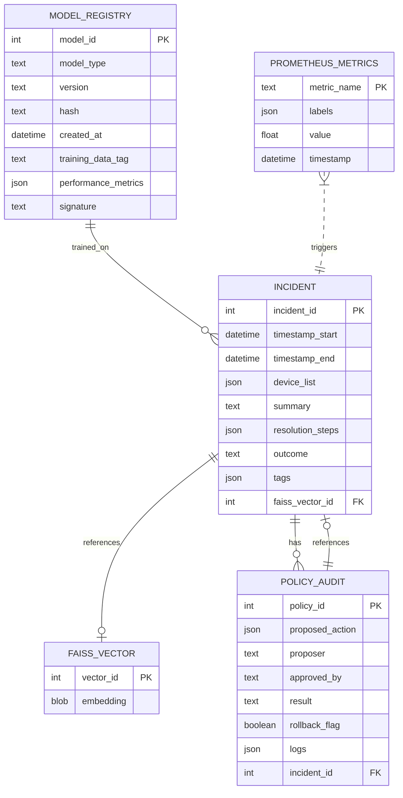

# Network-Chan Tentative Database Schema

**Prepared for:** Home lab / research deployment  
**Project name:** Network-Chan  
**Date:** 2026-03-14  
**Version:** 1.0 (Tentative — subject to iteration during Phase 1)  

## Introduction

This document outlines the tentative database schema for Network-Chan, focusing on the core data models for incident logging, model registry, policy audits, and telemetry metrics. The schema is designed for local-only operation, with SQLite as the primary embedded database on both the Appliance (Pi 5) and Assistant (PC/server) for simplicity and low overhead. FAISS is used alongside for vector embeddings (incident retrieval), not as a relational DB.

Key principles:

- **Simplicity & Performance**: Normalized where needed for queries, denormalized for speed on Pi (e.g., JSON blobs for complex fields).
- **Privacy & Security**: Redact sensitive data; immutable logs for audits; no cloud sync.
- **Extensibility**: Modular tables for future expansions (e.g., multi-Pi federation).
- **Replication**: Basic file-based backups on Pi; optional SQLite replication to Assistant via MQTT-synced dumps for central analytics.

Entity relationships are visualized with ER diagrams (Mermaid). Indexes are optimized for common queries (e.g., timestamp ranges, device filters). This schema supports the three-brain model: Perception (incident ingestion), Decision (model registry), Governance (policy audits).

## Database Overview

- **Primary DB**: SQLite (embedded, file-based; WAL mode for concurrency on Pi).  
- **Vector Index**: FAISS (file-based indexes for embeddings; integrated with SQLite via vector_id foreign keys).  
- **Storage Locations**:  
  - Appliance (Pi): Local SQLite for real-time logs + FAISS for edge retrieval (small, recent data).  
  - Assistant (PC): Mirrored SQLite (via periodic MQTT dumps) + full FAISS for long-term RAG.  
- **Size Estimates**: <100 MB for 1 year of home lab data (10k incidents, 1k models); prune old entries via retention policies.  
- **Backup/Replication**: Cron-based snapshots (rsync/SQLite backup API); no real-time replication (keep Pi lightweight); MQTT for delta syncs (e.g., new incidents).  

## Entity Relationships (ER Diagram)

### Entity Descriptions

1. **INCIDENT** (Core episodic records for incidents/anomalies)  
   - Table: incidents  
   - Fields:  
     - incident_id (INT PRIMARY KEY AUTOINCREMENT)  
     - timestamp_start (DATETIME NOT NULL)  
     - timestamp_end (DATETIME)  
     - device_list (JSON NOT NULL) — e.g., ["192.168.1.1", "AP-01"]  
     - summary (TEXT NOT NULL)  
     - resolution_steps (JSON) — array of steps taken  
     - outcome (TEXT) — "success"/"failure"/"partial"  
     - tags (JSON) — e.g., ["congestion", "security"]  
     - faiss_vector_id (INT FOREIGN KEY REFERENCES faiss_vectors(vector_id))  
   - Relationships: 1:1 with FAISS_VECTOR (embedding for RAG); 1:N with POLICY_AUDIT (audits per incident); N:1 with MODEL_REGISTRY (models trained on incidents).  

2. **FAISS_VECTOR** (Embeddings for incident similarity search)  
   - Table: faiss_vectors (or file-based index with SQLite metadata)  
   - Fields:  
     - vector_id (INT PRIMARY KEY AUTOINCREMENT)  
     - embedding (BLOB NOT NULL) — binary vector data (e.g., 768-dim float32 array)  
   - Relationships: 1:1 with INCIDENT (each incident has one embedding).  

3. **MODEL_REGISTRY** (Versioned ML models/checkpoints)  
   - Table: model_registry  
   - Fields:  
     - model_id (INT PRIMARY KEY AUTOINCREMENT)  
     - model_type (TEXT NOT NULL) — "q_learning" / "gnn_policy" / "anomaly_detector"  
     - version (TEXT NOT NULL)  
     - hash (TEXT NOT NULL) — SHA256 for integrity  
     - created_at (DATETIME NOT NULL)  
     - training_data_tag (TEXT) — e.g., "incidents_2026-03"  
     - performance_metrics (JSON) — e.g., {"accuracy": 0.95, "f1": 0.92}  
     - signature (TEXT) — digital sign for verification  
   - Relationships: N:1 with INCIDENT (models trained on tagged incidents).  

4. **POLICY_AUDIT** (Immutable logs for governance decisions)  
   - Table: policy_audits  
   - Fields:  
     - policy_id (INT PRIMARY KEY AUTOINCREMENT)  
     - proposed_action (JSON NOT NULL) — e.g., {"type": "restart_device", "params": {"mac": "AA:BB:CC:DD:EE:FF"}}  
     - proposer (TEXT NOT NULL) — "edge_rl" / "llm_assistant" / "admin"  
     - approved_by (TEXT) — "policy_engine" / "admin"  
     - result (TEXT) — "success" / "failed" / "rolled_back"  
     - rollback_flag (BOOLEAN DEFAULT FALSE)  
     - logs (JSON) — detailed traces  
     - incident_id (INT FOREIGN KEY REFERENCES incidents(incident_id))  
   - Relationships: N:1 with INCIDENT (audits linked to incidents).  

5. **PROMETHEUS_METRICS** (Time-series metrics; not relational—Prometheus TSDB)  
   - Logical Schema (for reference; stored in Prometheus):  
     - metric_name (TEXT PRIMARY KEY) — e.g., "network_latency_seconds"  
     - labels (JSON) — e.g., {"device": "192.168.1.1"}  
     - value (FLOAT)  
     - timestamp (DATETIME)  
   - Relationships: Can trigger INCIDENT creation (e.g., via alert rules); not directly FK-linked.  

## Indexes

To optimize common queries (e.g., time-range filtering, device searches):

- **incidents**: INDEX on timestamp_start, timestamp_end (for ranges); INDEX on device_list (JSONB if SQLite supports); UNIQUE on incident_id.  
- **faiss_vectors**: FAISS handles vector indexing (FlatL2 or IVFFlat); SQLite INDEX on vector_id.  
- **model_registry**: INDEX on created_at (for versioning); UNIQUE on hash.  
- **policy_audits**: INDEX on incident_id (FK); INDEX on timestamp (inferred from logs JSON if needed).  
- **prometheus_metrics**: Prometheus internal indexing on timestamp/labels; no custom SQLite indexes.

## Replication and Data Management

- **Appliance (Pi)**: Single SQLite file (WAL mode for concurrent reads/writes); FAISS index files. No real-time replication — snapshot backups via cron/rsync to local storage. Retention: Prune incidents >90 days.  
- **Assistant (PC)**: Mirrors Pi SQLite via MQTT-synced dumps (periodic full or delta exports); full FAISS for aggregated vectors. Replication: One-way from Pi to PC (rsync or MQTT file transfer). Retention: 1–2 years, with archiving.  
- **Failover**: If Pi down, Assistant uses last snapshot; no hot replication (keeps Pi simple).  
- **Backup Strategy**: Daily SQLite backups (sqlite3 .backup command); FAISS index dumps. Encrypted with AES (via config).  
- **Performance**: SQLite for <10k incidents/year; scale to PostgreSQL if enterprise. FAISS for <1M vectors (home lab scale).  

This tentative schema supports efficient querying, retrieval, and auditing while remaining lightweight for the Pi. It will be refined during Phase 1 with ER tool visualizations.
