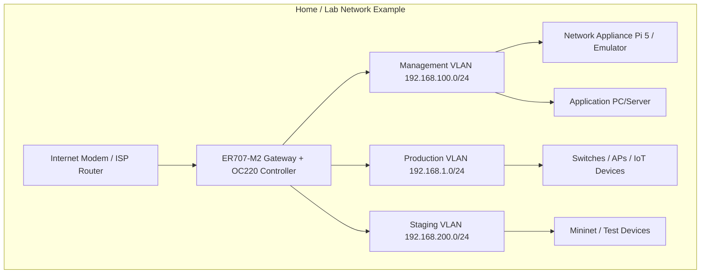

# Network-Chan Network Design Document

**Project name:** Network-Chan  
**Date:** 2026-03-21  
**Version:** 1.1 (updated for current architecture & requirements)  

## Introduction

This Network Design Document (NDD) details how Network-Chan integrates into various network environments as a standalone MLOps network appliance (Raspberry Pi 5 emulator or physical hardware) and its associated central Application (PC/server). It covers subnetting, routing, VLANs, redundancy, failover strategies, and common network types (home lab, small business, prosumer).

The design emphasizes local-only operation, safety-first principles (fail-open, recoverable states), and extensibility. Network-Chan operates as a management plane controller: the Network Appliance resides on a dedicated management VLAN for monitoring/remediation, while the Application connects via secure MQTT for analytics, training, and centralized config/logs viewing.

All designs assume TP-Link Omada ecosystem as primary (ER707-M2 gateway + OC220 controller), with Netmiko for multi-vendor support. No cloud dependencies; focus on on-premises resilience.

## High-Level Network Topology

Network-Chan deploys in a segmented topology to isolate management traffic, staging for experiments, and production.

- **Management VLAN**: Appliance + Application + MQTT broker + management traffic.
- **Production VLAN**: Monitored devices (clients, APs, IoT).
- **Staging VLAN**: Safe testing, Mininet emulation, chaos injection.

## Key Design Principles

- **Fail-Open**: Network functions normally if Appliance/Application unavailable.
- **Recoverable States**: Snapshots of configs before changes; rollback <60s on failure.
- **Security Isolation**: Management traffic segregated; no direct production VLAN access from Appliance.
- **Centralized Visibility**: Appliance pushes config/logs to Application via MQTT → unified dashboard view (reduces need for direct Appliance login).
- **MQTT Bridge**: Secure (TLS 1.3 + mutual certs) pub/sub between layers.

## Common Network Types and Network-Chan Fit

### Home Lab / Hobbyist Network

- **Typical Setup**: Modem → ER707-M2 Gateway → Switch/APs (5–20 devices).
- **Fit**:
  - Appliance on management VLAN (emulator or Pi 5).
  - Application on same PC or separate mini-PC.
  - Auto-remediation (channel change, client steer) with low autonomy initially.
- **Subnetting**: Simple /24 VLANs.
- **Routing**: Static via ER707.
- **Redundancy**: None (low-cost, hobbyist).
- **Failover**: Manual restart of emulator/Pi or Application.

### Small Business / Prosumer Network

- **Typical Setup**: Firewall → Core Switch → Multiple APs/VLANs (20–80 devices).
- **Fit**:
  - Appliance on management VLAN; monitors/audits guest/production VLANs.
  - Application on server for reports, centralized config/logs.
  - Semi-autonomous remediation with rollback guardrails.
- **Subnetting**: /24 per VLAN (management/production/guest).
- **Routing**: OSPF or static.
- **Redundancy**: Dual ER707 with VRRP (future).
- **Failover**: Auto-switch to spare emulator instance if physical Pi fails.

### Enterprise / Multi-Site (Future)

- **Typical Setup**: Core Router → Layer 3 Switches → Distributed APs (100+ devices).
- **Fit**:
  - Appliance per site on management VLAN; multi-agent RL coordination.
  - Application on VM/server for centralized governance.
- **Subnetting**: /16 production, /24 management/DMZ.
- **Routing**: BGP/OSPF.
- **Redundancy**: N+1 Appliance instances, redundant MQTT brokers.
- **Failover**: VRRP + auto-failover scripts.

## Redundancy & Failover Strategies

- **Appliance Failover**:
  - Current: Manual restart of emulator/Pi.
  - Future: VRRP IP failover or spare Pi container.

- **Application Failover**:
  - Active-passive (manual switch in home lab).
  - Future: Container orchestration (Docker Compose HA or Kubernetes for enterprise).

- **MQTT Broker**:
  - Mosquitto in Docker; future HA mode or bridge clustering.
  - Failover: DNS round-robin or fallback broker endpoint.

- **Data Failover**:
  - SQLite WAL mode + cron backups.
  - FAISS index replication via rsync/MQTT.

- **General Fail-safe**:
  - Fail-open defaults (device configs unchanged if Network-Chan down).
  - Atomic changes with snapshots; 60s auto-rollback on failure.
  - Autonomy levels limit risk (e.g., level 0–1 = no actions).

## Integration Points

- **MQTT Broker**: Central pub/sub (Mosquitto + TLS); topics: /telemetry, /models, /config, /logs.
- **Prometheus/Grafana**: Scraping on Appliance; dashboards in Application Vue UI.
- **Mininet/PettingZoo**: Simulation API for RL training/validation.
- **Home Assistant**: MQTT sensors/commands (future deeper integration).

This NDD ensures Network-Chan integrates seamlessly into diverse networks, with strong emphasis on safety, isolation, and resilience. It will be updated during Phase 2 (Appliance MVP) with detailed configs and VLAN examples.
